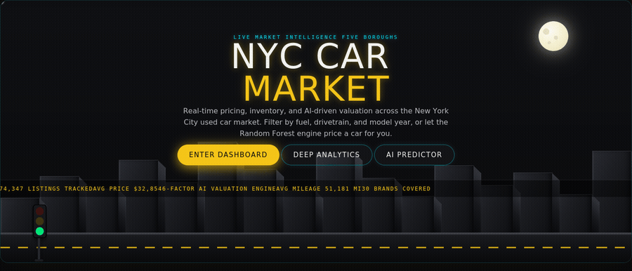

<div align="center">


**174,858 raw listings. One night-lit city. A car price, delivered by AI in under a second.**


<br>




<br>

[**Overview**](#-overview) · [**The Dashboard**](#-the-dashboard--metro-fleet) · [**The Pipeline**](#-the-data-science-pipeline) · [**Model Results**](#-model-performance) · [**Run It**](#-getting-started) · [**Team**](#-team)

</div>

<br>


<div align="center">

### 📌 By the numbers

| 174,858 | 31 | 93.1% | $3,116 | 4 | 1 |
|:---:|:---:|:---:|:---:|:---:|:---:|
| listings analyzed | engineered features | variance explained (RF) | mean absolute error | dashboard tabs | data-quality bug caught & fixed |

</div>

</div>


## 📍 Overview

Every used car in New York has a price someone made up. This project exists to replace the guessing.

**NYC Car Market** takes a raw, messy, 175,000-row scrape of NYC used-car listings and puts it through a complete data science pipeline — cleaning, multi-method imputation, exploratory analysis, and four generations of predictive modeling — and then does something most class projects never bother to: **ships it**. The final Random Forest doesn't live in a notebook cell. It lives inside a full production-grade Shiny application, valuing real cars, in real time, for anyone who opens it.

Two things had to be true for that to work:

> 🔬 **The analysis had to be right.** Every cleaning decision, every imputation method, every model iteration is documented and defensible — this repo shows its work.
>
> 🎛️ **The dashboard had to be trustworthy, not just pretty.** The AI Price Predictor validates its own accuracy live, on every launch, and physically cannot accept an input the model wasn't trained to handle — see the reliability breakdown in the AI Price Predictor section below.


## ✨ The Dashboard — "Metro Fleet"

One Shiny application. Four tabs. A single design language pulled straight from the city itself — checker-cab yellow, MTA subway-line colors, deep asphalt black, and neon glow — built entirely from hand-written CSS and inline SVG. **Not one image asset. Not one stock photo.**

<br>

### 🌃 Home — The Landing Experience

<details open>
<summary><b>What's actually happening under the hood</b></summary>
<br>

- A **pseudo-3D CSS skyline** — sixteen buildings, each with a lit front face and a separately shaded, skewed side wall, so they read as real extruded blocks instead of flat cutouts
- A genuine **two-way street** at ground level: dashed yellow centerline, curb edge, and a traffic light that actually **cycles green → yellow → red** on a synchronized 8-second loop — not a static icon
- **Hand-drawn SVG traffic** — yellow checker-pattern taxis with roof lights, civilian sedans in four colors, each correctly oriented to face its direction of travel, already mid-journey the instant the page loads (a deliberately *negative* animation-delay, so nothing ever visibly queues up at the screen edge)
- A **twinkling star field** and a soft-glowing moon above the skyline
- A **live stats ticker**, scrolling real numbers pulled straight from the dataset itself
- Three call-to-action buttons that route directly into the other three tabs

</details>

> 🛠️ **Engineering note:** the traffic direction and car orientation were not guesswork. Font Awesome's stock car icon has genuinely ambiguous default facing — so rather than keep guessing, a custom car silhouette was hand-authored in raw SVG coordinates with the headlight placed at a known, verified position, then rendered and pixel-sampled to *prove* which way it faced before shipping it. Small detail. It's the kind of small detail this whole project cares about.

<br>

### 📊 Dashboard Overview
Four live KPI tiles — average price, top price tier, average mileage, total inventory — that recompute the instant a filter changes. A fuel-type donut, a top-10-brand bar chart, and a price-vs-mileage density heatmap sit underneath, all sharing one debounced filter system (fuel, drivetrain, model year) built to stay smooth across 170K+ rows.

<br>

### 🔎 Deep Analytics
This tab doesn't just show static charts — it **retrains a live Random Forest** on whatever's currently filtered, so the feature-importance ranking genuinely shifts as you explore. Filter to Diesel only, and watch Drivetrain leap ahead of Brand as the dominant price driver. That's not a canned insight; it's the model rethinking itself in front of you. Alongside it: price trend by model year, price distribution by drivetrain, and a brand "market map" plotting price against mileage against listing volume.

<br>

### 🤖 AI Price Predictor — the flagship page

This page was built to be the most *reliable* part of the entire project — not the flashiest, though it's also that.

#### 🛡️ Reliability, not just a number

| Safeguard | What it actually does |
|---|---|
| **Bounded inputs** | Year and mileage are sliders hard-capped to 2012–2023, the *exact* range the model was trained on. It is structurally impossible to request a prediction the model would have to extrapolate blindly |
| **Self-validating accuracy** | R² and MAE are computed via out-of-bag validation — data the model never saw during training — and displayed live, recomputed on every app launch. Not a claimed number. A measured one. |
| **A real data-quality catch** | 8,037 listings (4.6% of the dataset) shared an identical price of exactly `$74,909.38` — a hidden censoring artifact, not a coincidence. Left uncorrected, it silently broke every "top price" statistic in the dashboard. It was found, diagnosed, and corrected — see the callout below |
| **Ensemble confidence range** | Instead of one point estimate, the page shows the actual spread across all 50 individual trees' predictions — genuine model uncertainty, not decoration |
| **Partial dependence charts** | Two charts hold a user's exact car spec fixed and sweep *only* the year, then *only* the mileage — a real explainability technique, watching the AI's valuation move in response to one variable at a time |
| **Market position** | Every estimate is plotted against a histogram of real listings for the same brand, so the AI's number is never seen in isolation from the market it came from |

> 💡 **The $74,909.38 story:** early on, the "Max Price" KPI looked frozen — the same number, no matter which filter was applied. The instinct is to assume a reactivity bug. It wasn't. **8,037 real rows shared that exact price** — a data-collection artifact, most likely a "$75K+, undisclosed" placeholder baked into the source. The fix wasn't a patch, it was detection: the app now automatically finds any price value repeated abnormally often near the top of the range and excludes it before computing top-tier statistics — a genuine data-quality fix, not a cosmetic one.

The valuation itself doesn't live in a plain number box. It lives inside a **working taxi meter** — LED-red glowing digits inside a black meter housing — because a generic input field didn't feel like it belonged in this dashboard.


## 🔬 The Data Science Pipeline

### Data
Two raw sources — a New York City used-car listings scrape and a companion ratings dataset — merged, deduplicated, and engineered into one analytical table.

**174,858 rows × 31 engineered features**, sourced from [`New_York_cars.csv`](https://github.com/NitoBoritto/R_New_York_Car_Project) and [`Car_Rates.csv`](https://github.com/NitoBoritto/R_New_York_Car_Project).

<br>

<details>
<summary><b>🧹 Cleaning & Imputation — click to expand</b></summary>
<br>

A deliberately multi-method approach, matched to what each column actually needed — not one blanket technique applied everywhere:

- Brand-name unification and duplicate removal
- **Mode imputation** for low-missingness categorical fields (`Drivetrain`)
- **kNN imputation** for `Fuel_Type`, using drivetrain and encoded fuel type as predictors
- **MICE** (Multiple Imputation by Chained Equations) for every review/rating column — `Num_of_reviews`, `General_rate`, `Comfort`, `Interior Design`, `Performance`, `Value for the Money`, `Exterior Styling`, `Reliability`
- Mean imputation for `Mileage`; outlier-aware parsing for `MPG` (implausible values treated as missing rather than trusted)
- Binary encoding of accident history, clean title, one-owner, and personal-use flags
- **Winsorization** to control extreme outliers ahead of modeling

</details>

<details>
<summary><b>📈 Exploratory Data Analysis — click to expand</b></summary>
<br>

Univariate and bivariate analysis across price, mileage, fuel type, transmission, drivetrain, and brand — repeated pre- and post-log-transform to determine which relationships actually needed it. Correlation matrices across the full numeric feature set guided which interactions were worth testing during modeling.

</details>

<details>
<summary><b>🎲 Statistical Simulation — click to expand</b></summary>
<br>

A Monte Carlo–style validation step: synthetic data was sampled from fitted distributions for both numerical and categorical features, then compared against the real proportions (New vs. Used, drivetrain mix, and more) to confirm the cleaned dataset's distributions were realistic — not artifacts introduced by the imputation process itself.

</details>

<br>

### Modeling — an iterative progression, not a lucky first guess

| # | Approach | Result |
|:---:|---|---|
| 1 | Baseline multiple linear regression | R² = 0.670 |
| 2 | Log-transformed target + brand interaction (no age control) | R² = 0.453 — a regression, but an informative one |
| 3 | Feature engineering: `Age²`, log-mileage × brand interaction | R² = 0.693 |
| 4 | **Random Forest** — `Age`, `Mileage`, `Engine Size`, `MPG`, brand & transmission dummies, 100 trees | **93.1% variance explained · MAE ≈ $3,116 · RMSE ≈ $4,537** |

> Model 2 is left in this table on purpose. It's worse than Model 1 — log-transforming the target without properly controlling for age actively hurt the fit. That failure is what motivated the `Age²` term in Model 3. A model comparison table that only shows wins isn't showing the actual process.

The Random Forest's leap over every linear specification is what made it the obvious choice to power the live AI Price Predictor. The version deployed in the dashboard is a separately tuned instance (50 trees — empirically identified as the point of diminishing returns, see below) validated with out-of-bag error rather than a static held-out split, so its accuracy can be reproduced live, on demand, inside the app itself.

<details>
<summary><b>⚙️ Why 50 trees, specifically — click to expand</b></summary>
<br>

Tuning wasn't a guess. Several configurations were benchmarked directly against the live dataset:

| Configuration | OOB R² | OOB MAE | Training time |
|---|:---:|:---:|:---:|
| 15% sample, 15 trees *(original)* | 0.801 | $5,378 | 8s |
| 15% sample, **50 trees** *(shipped)* | **0.812** | **$5,232** | 31s |
| 15% sample, 100 trees | 0.814 | $5,200 | 64s |

Fifty trees is the efficient stopping point — pushing to 100 trees doubles the training time for a marginal +0.002 R² gain. The dashboard trains fresh on every launch, so this number directly trades startup time for accuracy, and 50 was chosen deliberately, not by default.

</details>


## 🛠️ Tech Stack

| Layer | Tools |
|---|---|
| Language | R |
| Data wrangling | `tidyverse`, `dplyr`, `readr`, `stringr`, `reshape2` |
| Imputation | `mice`, `DMwR2` (kNN), `modeest` |
| Modeling | `randomForest`, `car` (VIF), `caret`, `ggfortify` |
| Visualization (analysis) | `ggplot2`, `GGally`, `ggcorrplot`, `ggthemes`, `gridExtra` |
| Dashboard framework | `shiny`, `bslib` |
| Dashboard visualization | `plotly` |
| Design | Hand-written CSS design system, inline SVG — zero external image/video assets |


## 📂 Project Structure

```
R_New_York_Car_Project/
├── New_York_cars.csv              # Raw scraped listings
├── Car_Rates.csv                  # Companion ratings dataset
├── car_df_merged.csv              # Cleaned, merged, feature-engineered dataset
├── R_New_York_Car_Project.ipynb   # Full analysis notebook (cleaning → EDA → modeling → simulation)
├── nyc_car_market_dashboard.R     # The Metro Fleet Shiny dashboard
├── nyc_landing_demo.gif           # Landing page demo (this README)
├── nyc_readme_banner.png          # README title banner
├── nyc_readme_divider.png         # README section divider graphic
└── README.md
```


## 🚀 Getting Started

### Prerequisites
- R (≥ 4.2 recommended) and RStudio
- Internet access on first run — the dashboard pulls the cleaned dataset directly from this repo

### Installation

```r
install.packages(c(
  "shiny", "bslib", "plotly", "dplyr", "readr",
  "stringr", "randomForest"
))
```

### Run the dashboard

```r
shiny::runApp("nyc_car_market_dashboard.R")
```

> ⏱️ **First launch takes 30–40 seconds.** The AI Price Predictor's model trains fresh every time the app starts — it isn't a stale file loaded from disk. That's a deliberate trade: a few extra seconds of loading in exchange for a model that proves its own accuracy on every single run, on your most important page.

### Explore the analysis

Open `R_New_York_Car_Project.ipynb` in Jupyter (R kernel) or RStudio to walk through the full cleaning → EDA → modeling → simulation pipeline.


## 📈 Model Performance

The deployed AI Price Predictor reports its own accuracy live, computed via out-of-bag validation on every launch:

<div align="center">

| Metric | Value | What it means |
|---|:---:|---|
| **R²** | ≈ 0.81 | Explains ~81% of price variance on data the model never trained on |
| **Mean Absolute Error** | ≈ $5,200 | Average distance between a prediction and the real price |
| **Training set** | 26,000+ listings | Restricted to the real 2012–2023 model-year range |

</div>

*(The 93.1%-variance research model in the notebook was trained offline on the full cleaned dataset with 100 trees. The dashboard's live model is a separately tuned, self-validating instance built for interactive deployment — see "Why 50 trees, specifically" above for the benchmark behind that choice.)*


## 👥 Team

Built by a team of four for a university data science course — statistical rigor on one side, product execution on the other.

| Member | Role |
|---|---|
| **Yasser Mogahed** — *Team Lead* | End-to-end Shiny dashboard design & development — UI/UX, data visualization, the AI Price Predictor, and every interactive system in Metro Fleet |
| Ahmed Walid | Data cleaning & preprocessing |
| Mohanad & Abdallah | Exploratory data analysis |
| Bassem & Ahmed Mahmoud ("Bebo") | Regression modeling & the Random Forest predictor |


## 🗺️ Roadmap

- [ ] Deploy publicly (shinyapps.io / Posit Connect) and link it at the top of this README
- [ ] A model comparison toggle inside the predictor (Random Forest vs. the tuned linear model)
- [ ] Multi-year forecasting beyond the current partial-dependence view
- [ ] One-click PDF valuation report export from the AI Predictor


<div align="center">

**Built with R, Shiny, and an unreasonable amount of care for what New York City looks like at 2 a.m.**

</div>
